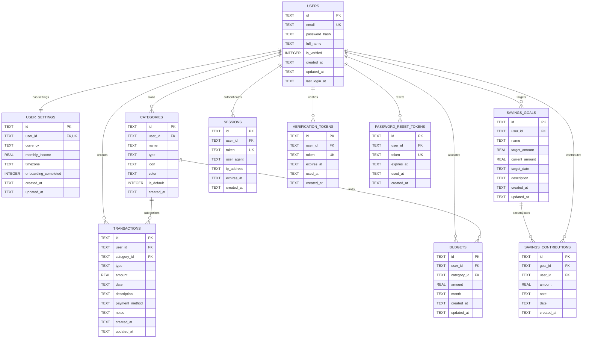

# Database Schema & Relational Architecture Documentation

## Overview
The application utilizes an embedded relational database (SQLite via Node.js native `DatabaseSync`) configured with:
* **Write-Ahead Logging (WAL Mode)** (`PRAGMA journal_mode = WAL`) for concurrent read/write operations and high throughput.
* **Foreign Key Constraints** (`PRAGMA foreign_keys = ON`) ensuring strict referential integrity.
* **Database Constraints**: `NOT NULL`, `CHECK`, `UNIQUE`, and `ON DELETE CASCADE / RESTRICT` enforcing domain rules at the storage level.

---

## Entity Relationship Diagram (ERD)

---

## Performance Indexes
* `idx_trans_user_date` on `transactions(user_id, date)`
* `idx_trans_category` on `transactions(category_id)`
* `idx_cat_user` on `categories(user_id)`
* `idx_budgets_user_month` on `budgets(user_id, month)`
* `idx_budgets_category` on `budgets(category_id)`
* `idx_goals_user` on `savings_goals(user_id)`
* `idx_contrib_goal` on `savings_contributions(goal_id, user_id)`
* `idx_sessions_token` on `sessions(token)`
* `idx_verif_tokens` on `verification_tokens(token)`
* `idx_pwreset_tokens` on `password_reset_tokens(token)`
